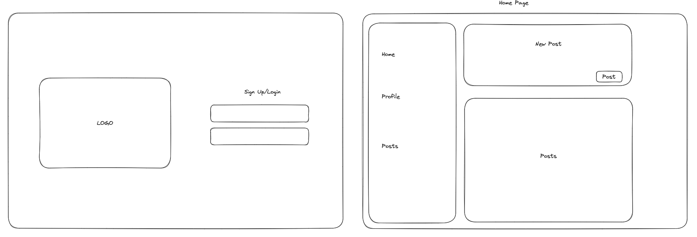

# `Mom Network`

A social media (twitter-clone) application for moms to connect with other moms and form a community.

## How to Install
1. `Fork` and `Clone` the social-media-f and social-media-b repositories in your terminal
2. Open both in separate terminals and run `npm i` to install dependencies 
4. Run `npm run dev` to connect to servers in backend and frontend terminals
5. Open `http://localhost:3000` in your web browser

## Accessing the Website Online
Visit: 

## User Stories 
- As a new mom, I want to create an account easily, so I can start connecting with other moms
 and seeking advice.
- As a user, I want to post short updates about my parenting experiences, challenges, and successes, so I can share and connect with other parents.
- As a parent seeking advice, I want to ask questions in the form of posts and receive answers, suggestions, and experiences from other parents.

## Wireframe

## Languages and Frameworks Used
- Javascript
- React
- MongoDB
- Tailwind

## Future Goals/Unsolved Problems
1. Improve UI/UX
2. Edit and delete posts
3. Comments feature
4. Follow feature
5. Messaging feature
